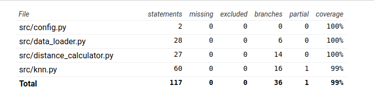

## Testausdokumentti
### Yksikkötestaus

- yksikkötestit toteutuettu seuraaville luokille:
  - DataLoader-luokka
  - KNN-luokka
  - DistanceCalculator-luokka
- käyttöliittymää ei testata, tämän sai jättää kurssin ohjeistuksen mukaisesti testien ulkopuolelle

- sovellus sisältää omat komennot sekä yksikkötestien ajamiselle, että testikattavuusraportin tuottamiselle

### Testikattavuusraportti

