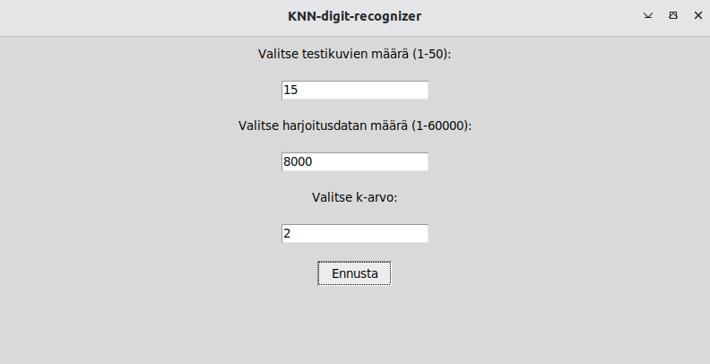
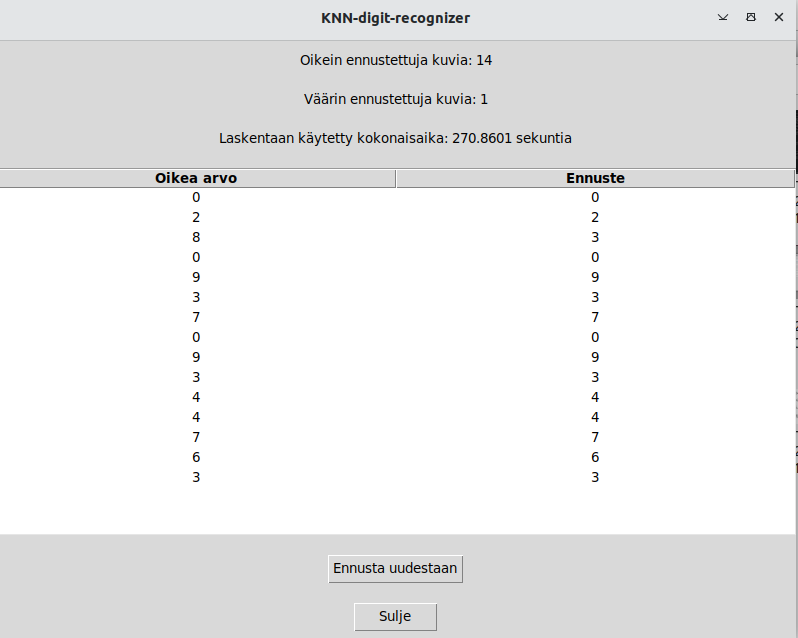

### Asennus

- kloonaa repositorio
- asenna riippuvuudet

  ```poetry install```

- aktivoi virtuaaliympäristö

  ```poetry shell```

### Komentorivityökalut

- ohjelman käynnistäminen
  
  ```poetry run invoke start```

- yksikkötestien ajaminen (ilman testikattavuusraporttia)

  ```poetry run invoke test```

- yksikkötestien ja testikattavuusraportin ajaminen

  ```poetry run invoke coverage-report```

### Käyttöliittymä

Ohjelma käynnistyy aloitusnäkymään, josta käyttäjä voi määrittää haluamansa arvot seuraaville muuttujille:



- testikuvien määrä (montako kuvaa ohjelmassa pyritään ennustamaan)
- harjoituskuvien määrä (montako kuvaa käytetään mallin kouluttamiseen)
- k-arvo (monenko naapurin perusteella ennuste nääritetään)

Ohjelma käyttää siis käyttäjän valitsemaa määrää satunnaisesti valittuja testi- ja harjoituskuvia.

**Ohjelma toimii tällä hetkellä hyvin hitaasti suurilla syötteillä, joten ohjelmaa kannattaa ajaa melko pienillä syötteillä**

Tulokset aukeavat uuteen näkymään:



Tulosnäkymästä käyttäjä voi tarkastella, montako käsinkirjoitettua numeroa pystyttiin ennustamaan oikein ja montako ennustettiin väärin. Lisäksi näkymässä näytetään laskentaan käytetty aika.

Taulukosta käyttäjä pystyy tarkastelemaan yksityiskohtaisemmin, mitkä satunnaisesti valitut käsinkirjoitetut numerot valikoituvat testaukseen ja minkä ennusteen algoritmi niille antoi.
