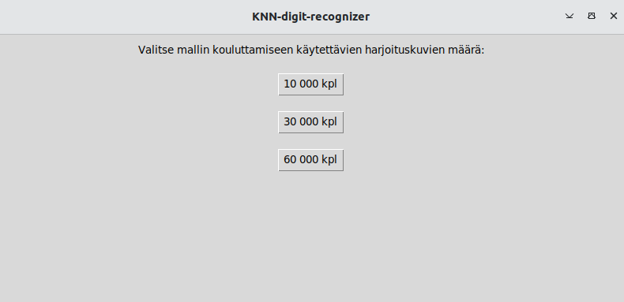
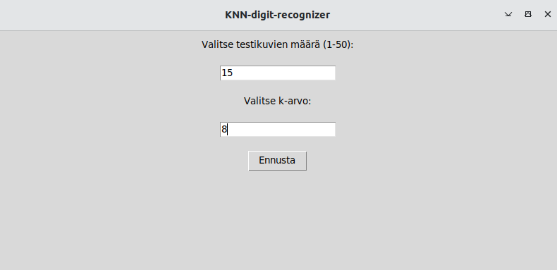
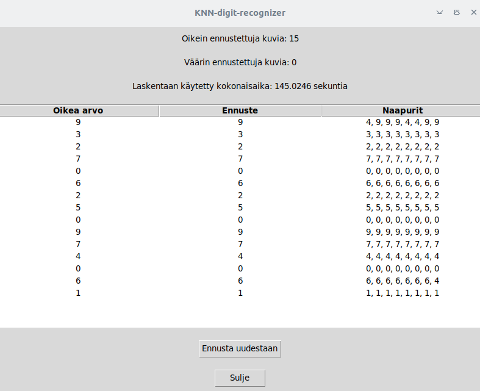

### Asennus

- kloonaa repositorio
- asenna riippuvuudet

  ```poetry install```

- aktivoi virtuaaliympäristö

  ```poetry shell```

### Komentorivityökalut

- ohjelman käynnistäminen
  
  ```poetry run invoke start```

- yksikkötestien ajaminen (ilman testikattavuusraporttia)

  ```poetry run invoke test```

- yksikkötestien ja testikattavuusraportin ajaminen

  ```poetry run invoke coverage-report```

### Käyttöliittymä

Ohjelma käynnistyy aloitusnäkymään, josta käyttäjä voi valita, montako harjoituskuvaa ohjelmassa käytetään mallin kouluttamiseen:



Ohjelmassa tapahtuvan laskennan kesto riippuu harjoitusdatan koosta, joten mikäli haluaa ajaa ohjelmaa nopeasti, kannattaa valita pienin määrä harjoitusdataa.

Harjoitusdatan valinnan jälkeen ohjelma lataa käytettävän datan ja esikäsittelee sen. Käyttäjä saa ilmoitusviestin, jossa pyydetään odottamaan, sillä datan lataaminen vie jonkin verran aikaa.

Kun ohjelmassa käytettävä data on ladattu, pääsee käyttäjä määrittämään testidatan määrän sekä k-arvon:



Tulokset aukeavat uuteen näkymään:



Tulosnäkymästä käyttäjä voi tarkastella, montako käsinkirjoitettua numeroa pystyttiin ennustamaan oikein ja montako ennustettiin väärin. Lisäksi näkymässä näytetään laskentaan käytetty aika.

Taulukosta käyttäjä pystyy tarkastelemaan yksityiskohtaisemmin, mitkä satunnaisesti valitut käsinkirjoitetut numerot valikoituvat testaukseen ja minkä ennusteen algoritmi niille antoi. Taulukko näyttää myös kaikki naapuriarvot, joita laskennassa saatiin.
